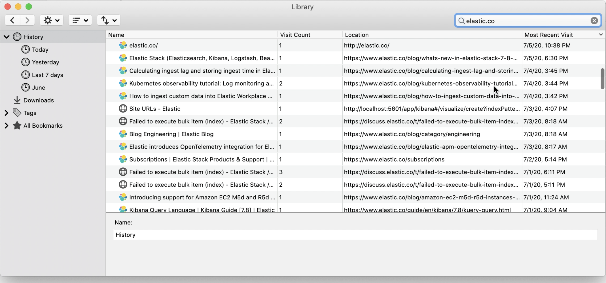
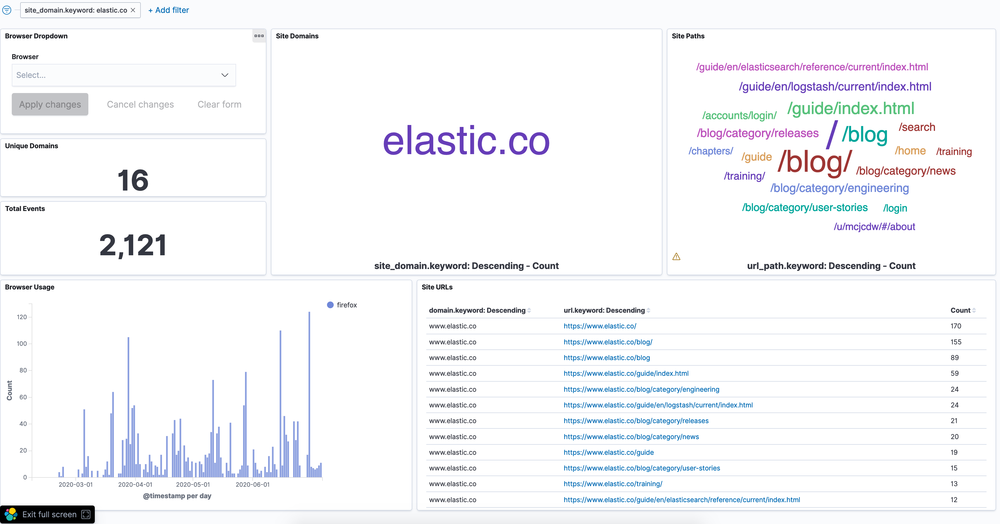

# Elastic Stack - Ingesting Browser History

## Make Browser History More Useful

This project's goal is improve the "history search problem" of the major Chromium based browsers.

If you search for "Browser History", you'll find more posts about Privacy, VPNs and other ways to protect your search history. Very few will discuss better ways to use or analyze your browser history. If you do find a solution, it will usually show you how to export history into a cvs file.


## All Browsers below save settings and history data to SQLite database

&nbsp;&nbsp;&nbsp;&nbsp;&nbsp;&nbsp;&nbsp;&nbsp;&nbsp;&nbsp;&nbsp;&nbsp; &nbsp;&nbsp;&nbsp;&nbsp;  


Brave, Chrome and Edge use same SQLite database file called `History` and the table structure is exactly the same. Firefox SQLite database file called is `places.sqlite`. Of course being an Apple product, Safari's SQLite database file called is `History.db`

```sql
SELECT 
	datetime(last_visit_time/1000000-11644473600,'unixepoch','localtime') AS visit_date, 
	url, 
	title AS url_title  
FROM urls 
ORDER BY visit_date DESC
```

**Let's get the most out of three fields!!**
- last_visit_time
- url
- title

### Instead of that...


### You can have this...



## Getting Started

Within 10 minutes (after docker image pulls), you will have all your browser(s) history in Elastic Stack.

<em>**Note:** You need to exit your browser(s). SQLite database does not have a with_no_lock option. If you do not quit your browser, the python script will error.</em>

### Prerequisites

Example has been tested on Mac with the following versions:
- Python 3.7.6
- Elasticsearch 7.8.0
- Logstash 7.8.0
- Kibana 7.8.0
- Docker 19.03.0
- Docker Compose 1.25.5

### 1. Extract Browser Data

After cloning the repo complete the following to extract browser data.
1. From the scripts folder, rename or copy `UPDATE-config.py` to `config.py` then update file with your local user path. 
2. Run browser-history python script:

```shell
cd scripts
python browser_history.py

Starting brave
brave: Results 4

Starting chrome
chrome: Results 1

Starting firefox
firefox: Results 3716

Starting safari
safari: Results 6

Starting edge

edge: Results 2
```

## 2. Launch Elastic Stack to Ingest Data

1. Launch Containers

	Docker Compose Ingest will launch Elasticsearch, Logstash and Kibana official Elastic images.
	```shell
	docker-compose -f docker-compose-ingest.yml up
	```

## 3. Load pre-made Visualization and Dashboards
After Kibana is ready you can load dashboard with the Import Dashboard API (experimental feature)
1. From Kibana sidebar, navigate to **Stack Management**
2. Under Kibana select **Saved Objects**
3. From Save Object select **Import** and navagate to repo location of BrowserHistory-Kibana.ndjson
4. Select **Import**
5. Select Browser History Dashboard

## Done!

# ToDo
- Workflow Recommendations
- Gotchas 